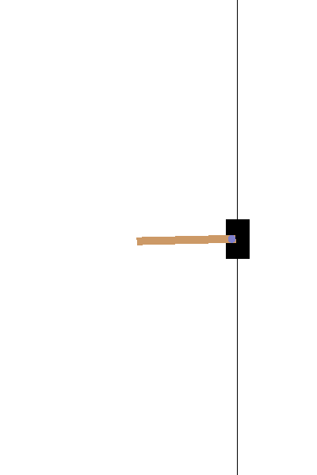

# EGN4060C-DQN-Agent
Tensorflow DQN Agent Using OpenAI Gym Enviroment

#todo
- save and load capability for the model
- plot reward over epoch and show total training time
- make gif of results

## Results

